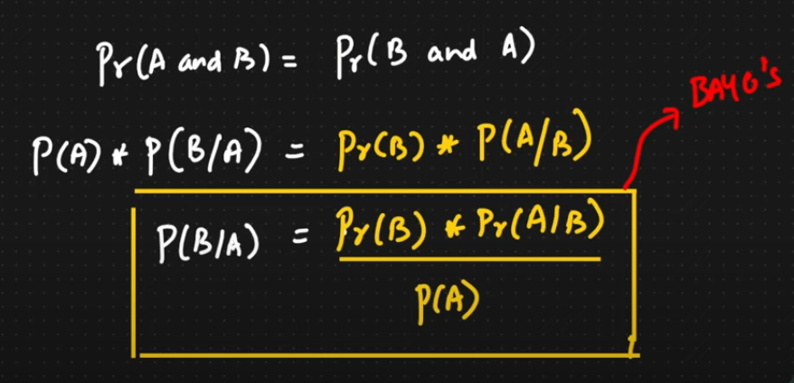
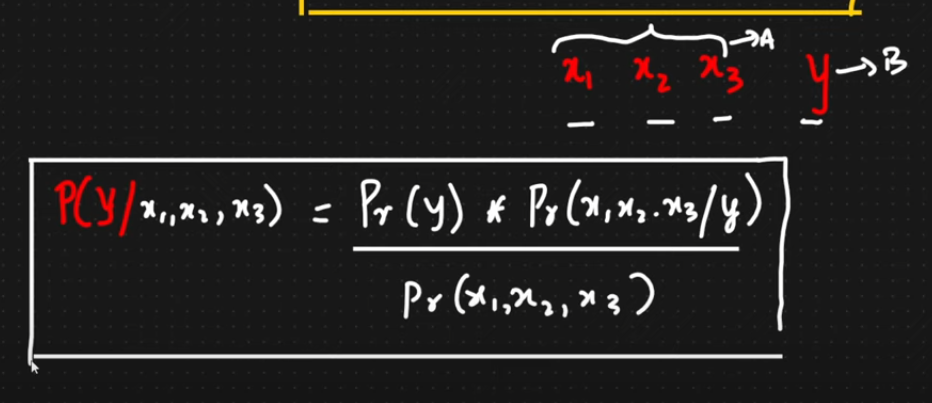

# Naive Bayes Algorithm

Naive Bayes is a **supervised machine learning algorithm** used for **classification problems**. It is based on **Bayes’ Theorem** with a strong assumption that features are **independent** of each other.

---

## 📘 Terms to Know

1. **Independent Events**: Events where the outcome of one does **not** affect the other.  
2. **Dependent Events**: Events where the outcome of one **does** influence the other.

---

## 📐 Bayes' Theorem

If `A` is the **event** (e.g., a class) and `B` is the **evidence** (features), then the **Bayes’ theorem** is used to calculate the **posterior probability** as:

---

## 🔢 Types of Naive Bayes

- **Gaussian Naive Bayes** – For continuous data (assumes normal distribution)
- **Multinomial Naive Bayes** – For discrete counts (e.g., word frequencies)
- **Bernoulli Naive Bayes** – For binary features (e.g., presence/absence of a word)

---

## ✅ Advantages

- Fast and simple to implement  
- Works well with high-dimensional data  
- Performs well for text classification problems  

---

## ⚠️ Limitations

- Strong independence assumption can reduce accuracy  
- Doesn’t capture relationships between features  

---

> This algorithm is widely used in applications like **spam filtering**, **sentiment analysis**, and **document classification**.
